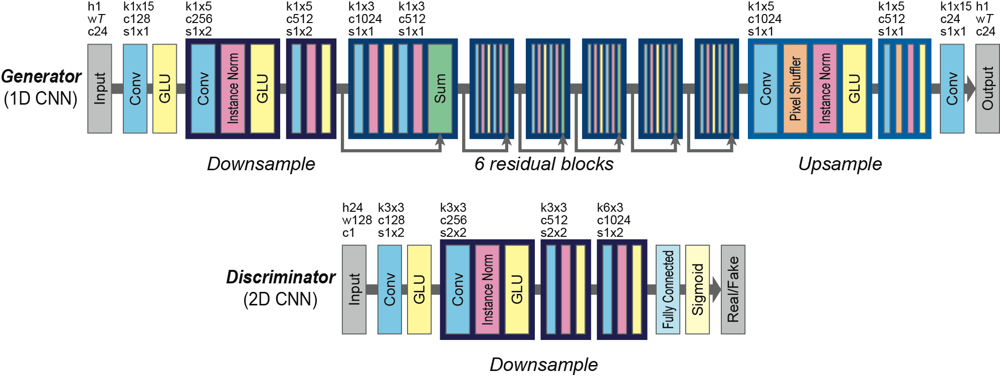

# Voice Converter CycleGAN

## Introduction

Cycle-consistent adversarial networks (CycleGAN) has been widely used for image conversions. It turns out that it could also be used for voice conversion. This is an implementation of CycleGAN on human speech conversions. The neural network utilized 1D gated convolution neural network (Gated CNN) for generator, and 2D Gated CNN for discriminator. The model takes Mel-cepstral coefficients ([MCEPs](https://github.com/eYSIP-2017/eYSIP-2017_Speech_Spoofing_and_Verification/wiki/Feature-Extraction-for-Speech-Spoofing)) (for spectral envelop) as input for voice conversions.

    

## Dependencies

* Python 3.5
* Numpy 1.14
* TensorFlow 1.8
* ProgressBar2 3.37.1
* LibROSA 0.6
* FFmpeg 4.0
* [PyWorld](https://github.com/JeremyCCHsu/Python-Wrapper-for-World-Vocoder)

## Reference

* Takuhiro Kaneko, Hirokazu Kameoka. Parallel-Data-Free Voice Conversion Using Cycle-Consistent Adversarial Networks. 2017. (Voice Conversion CycleGAN)
* Wenzhe Shi, Jose Caballero, Ferenc Huszár, Johannes Totz, Andrew P. Aitken, Rob Bishop, Daniel Rueckert, Zehan Wang. Real-Time Single Image and Video Super-Resolution Using an Efficient Sub-Pixel Convolutional Neural Network. 2016. (Pixel Shuffler)
* Yann Dauphin, Angela Fan, Michael Auli, David Grangier. Language Modeling with Gated Convolutional Networks. 2017. (Gated CNN)
* Takuhiro Kaneko, Hirokazu Kameoka, Kaoru Hiramatsu, Kunio Kashino. Sequence-to-Sequence Voice Conversion with Similarity Metric Learned Using Generative Adversarial Networks. 2017. (1D Gated CNN)
* Kun Liu, Jianping Zhang, Yonghong Yan. High Quality Voice Conversion through Phoneme-based Linear Mapping Functions with STRAIGHT for Mandarin. 2007. (Foundamental Frequnecy Transformation)
* [PyWorld and SPTK Comparison](http://nbviewer.jupyter.org/gist/r9y9/ca05349097b2a3926ec77a02e62c6632)
* [Gated CNN TensorFlow](https://github.com/anantzoid/Language-Modeling-GatedCNN)

## To-Do List

- [ ] Parallelize data preprocessing
- [ ] Evaluation metrics
- [ ] Hyper parameter tuning
- [ ] Argparse